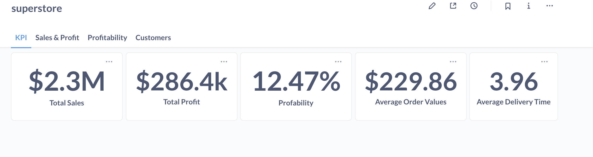
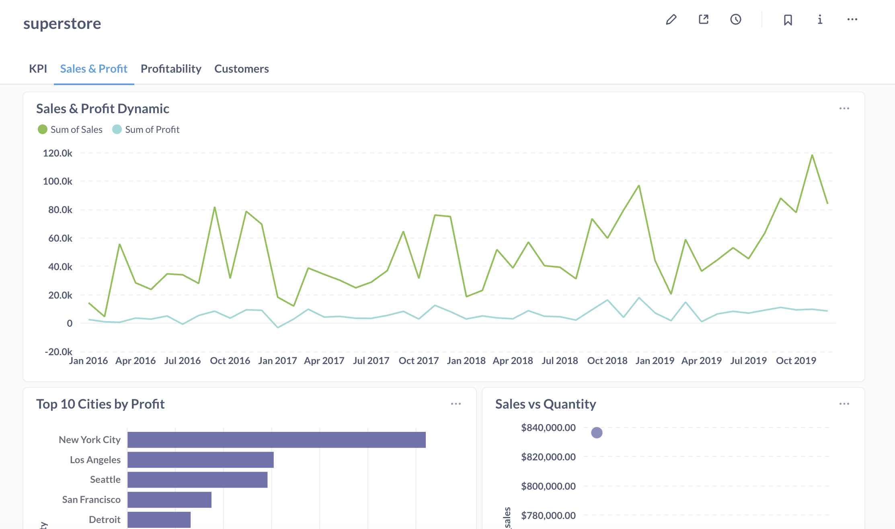
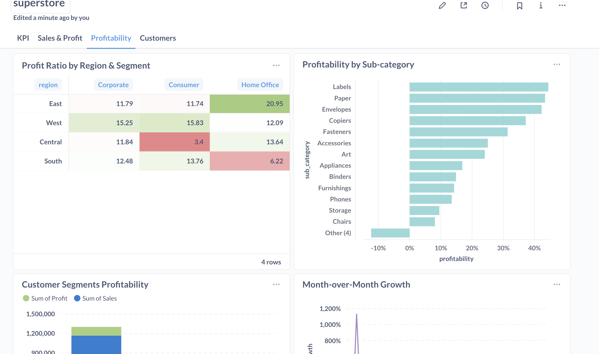
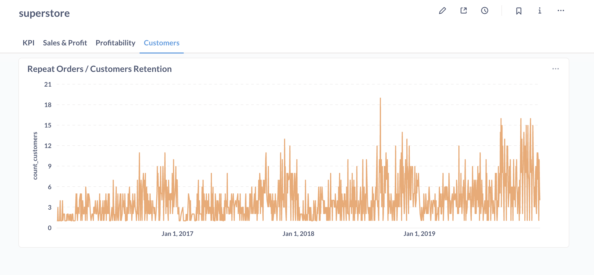

# Superstore project

This project processes the Superstore.xls dataset using the modern data engineering stack learned course [DataLearn](https://github.com/Data-Learn/data-engineering) in Module 4.
The pipeline performs ETL (Extract, Transform, Load) operations, builds a data mart in ClickHouse, and visualizes insights through Metabase dashboards.

---

## 🛠️ Tech Stack & Architecture

### Tech Stack

* [](https://www.python.org/)
* [](https://pandas.pydata.org/)
* [](https://clickhouse.com/)
* [](https://airflow.apache.org/)
* [](https://www.metabase.com/)
* [](https://www.docker.com/)
* [](https://docs.docker.com/compose/)
* [](https://www.getdbt.com/)

### Architecture


## 🧩 Структура проекта
```bash
.
├── Dockerfile.airflow
├── Makefile
├── README.md
├── dags                                   # DAG's
│   ├── file_watcher_dag.py
│   └── superstore_etl.py
├── data                                   # Folder with our fils
│   ├── Superstore.xls
│   └── input                              # Folder for triggered DAG file_watch_superstore
├── docker-compose.yml
├── docs                                   # project docs
│   └── architecture.drawio.svg
├── initdb                                 # sql scripts for init DB
│   └── init.sql
├── metabase_data                          # metabase files and db
├── notebooks                              # jupyter notebooks
│   └── work_with_superstore.ipynb
├── plugins                                # plugins for metabase
├── poetry.lock
├── pyproject.toml
├── src                                    # Python scripts
│   └── utils
│       ├── logger.py
│       └── snake_case.py
└── superstore_dbt                         # DBT project
    ├── README.md
    ├── dbt_project.yml
    ├── macros
    ├── models
    │   └── mart
    ├── package-lock.yml
    ├── packages.yml
    ├── profiles.yml
    ├── seeds
    └── tests
        └── check_count_rows_in_fct_sales.sql
```

--- 
## ⚙️ Getting Started 

### Prerequisites
- Docker and Docker Compose installed 
- Git 
- A `.env` file (if you use one) 

### Installation & Setup 

1. **Clone the repository:** 
   ```bash
   git clone [https://github.com/jinjik19/superstore_project](https://github.com/jinjik19/superstore_project) 
   cd superstore_project
   ```
   
2. **Set up environment variables:** 
   *Create a `.env` file in the root directory by copying the example file.* 
   ```bash
    cp .env.example .env
   ```
   *Modify the `.env` file with your specific settings (if any).*

3. **(For Linux/macOS users) Set the correct file permissions:**
   ```bash
   echo "AIRFLOW_UID=$(id -u)" >> .env
   ```
   *Modify in the `.env` file var AIRFLOW_UID.*
   
4. **Build and run the services:** 
   ```bash 
   docker-compose up --build -d 
   ```

5. **Copy Superstore.xls to input folder.**
   ```bash
   cp data/Superstore.xls data/input/Superstore.xls
   ```
   *DAG's will be launched when found Superstore.xls in data/input/*

--- 
   
## 🕹️ Usage 

- http://localhost:8080 - Airflow UI. You can manage DAGS. The first DAG is named `file_watch_superstore`. `file_watch_superstore` check file Superstore.xls in folder `data/input/`. When Superstore.xls catched, after that `file_watch_superstore` triggered the second DAG `superstore_etl`. This DAG run load data from file to Clickhouse and after that transform and create data mart

- http://localhost:8000 - Metabase Dashboard. test@example.com/superstore12345
- http://localhost:8001 - dbt data docs.
- http://localhost:8123 - URI for connect to Clickhouse. USER: default

---

## 📊 Data Model 

Final Data Mart Fact table: mart_fct_sales


| Column Name    | Data Type | Description                                              |
| :------------- | :-------- | :------------------------------------------------------- |
| sales_key      | UInt64    | Unique identifier for each sales record.                 |
| sales          | Float64   | The total sales amount for the transaction.              |
| quantity       | Int32     | The number of units sold.                                |
| profit         | Float64   | The profit generated from the sale.                      |
| discount       | Float32   | The discount applied to the sale, likely as a percentage.|
| order_key      | Int64     | Foreign key referencing mart_dim_orders.                 |
| product_key    | Int64     | Foreign key referencing mart_dim_product.                |
| geo_key        | Int64     | Foreign key referencing mart_dim_get.                    |
| customer_key   | Int64     | Foreign key referencing mart_dim_customer.               |
| ship_key       | Int32     | Foreign key referencing mart_dim_shipping.               |
| manager_key    | Int64     | Foreign key referencing mart_dim_managers.               |
| order_date_key | Int32     | Foreign key referencing mart_dim_calendar.               |
| ship_date_key  | Int32     | Foreign key referencing mart_dim_calendar.               |

---

## 📊 Dashboard

### KPI


### Sales & Profit


### Profitability


### Customers

